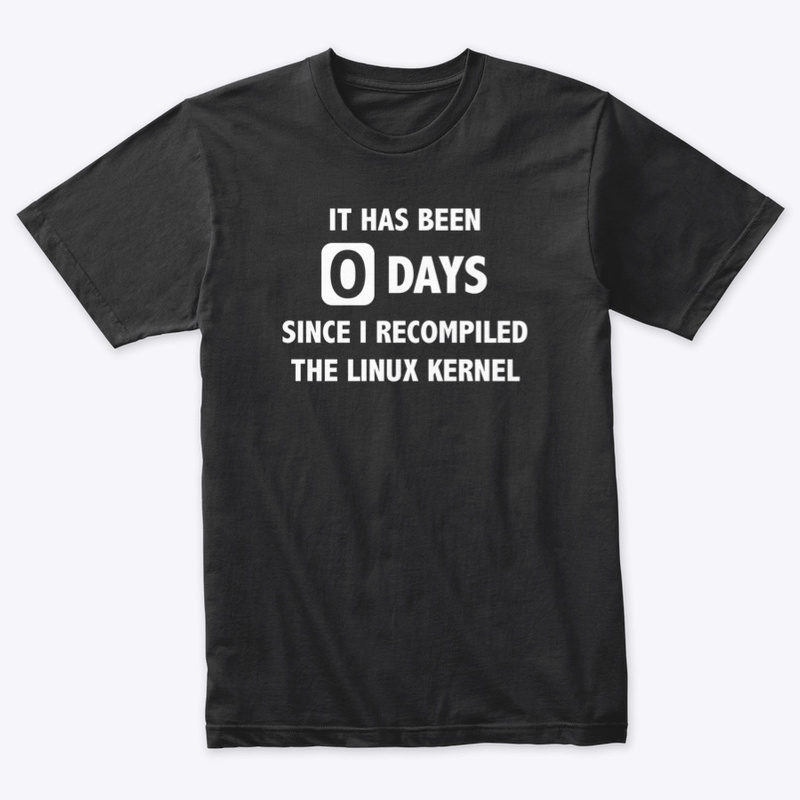

# A worker to keep track of your days since something

Programmers often find themselves in a situation where they repeat certain tasks, 
sometimes it's to brag about how frequently they do something, sometimes it's to show frustration on things that break often, 
for example `it has been 0 days since I had to do a windows update` or `it has been 0 days since it was the DNS` or `it hasIts been 0 days since I pushed to github`.
So I made this worker to keep track of how many days since something happened and respond with a [shields badge](https://shields.io/).

<p align="center">
  <a href="https://redshirtjeff.com/listing/linux-recompile-shirt">
    
  </a>
</p>


## Getting Started


### Prerequisites

You need to install npm packages on your machine.

```sh
npm i
```

Copy and rename the `wrangler.toml.example` to `wrangler.toml` .

```sh
cp example.wrangler.toml wrangler.toml
```


### Usage


Set counter for something.
```sh
curl -X PUT -u user:secure password http://localhost:8787/I-recompiled-linux-kernel
```

Get the badge for something.
```sh
curl http://localhost:8787/I-recompiled-linux-kernel
```

Get the list of counters.
```sh
curl http://localhost:8787/
```

Delete a counter.
```sh
curl -X DELETE -u user:secure password http://localhost:8787/I-recompiled-linux-kernel
```


### Deployment

To deploy your own counter you need a cloudflare account. You can get a free account [here](https://dash.cloudflare.com/sign-up).

Create KV namespace.

```sh
wrangler kv:namespace create "COUNTER_STORAGE"
wrangler kv:namespace create --preview "COUNTER_STORAGE"
```

Add the namespace id and preview_id in the `wrangler.toml` file.

```toml
[[kv_namespaces]]
  binding = "COUNTER_STORAGE"
  id = "xxxxxxxxxxxxxxxxxxxxxxxxxxxxx"
  preview_id = "xxxxxxxxxxxxxxxxxxxxxxxxxxxx"
```

Set a secure username and password in the `wrangler.toml` file.

```toml
[vars]
USERNAME = "user"
PASSWORD = "secure password"
```
